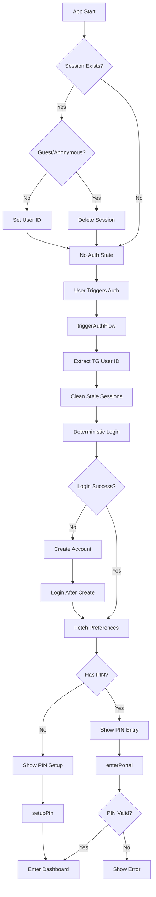

# Shield-ET Authentication Flow Documentation

## Overview

Shield-ET uses a **deterministic authentication system** designed for Telegram Mini Apps that provides secure, PIN-protected access to sensitive domestic violence safety features. The authentication flow is managed entirely by the `SafetyContext` and ensures users are properly authenticated before accessing any protected resources.

---

## Core Principles

1. **No Anonymous Sessions**: The app NEVER creates anonymous or guest sessions. All operations require a fully authenticated user.
2. **Deterministic Identity**: User identity is derived from Telegram user ID, ensuring consistent authentication across sessions.
3. **PIN-Based Vault Access**: A secondary PIN layer protects access to the safety dashboard and vault.
4. **Single Source of Truth**: All authentication logic lives in `SafetyContext.tsx` - no other components should manage sessions.

---

## Authentication Architecture



---

## Key Components

### 1. SafetyContext (`context/SafetyContext.tsx`)

**Purpose**: Centralized authentication state management and session control.

**Key State**:
- `isSecure`: User has entered correct PIN and can access dashboard
- `isNewUser`: User needs to set up a PIN (no `vault_pin` in preferences)
- `isAuthReady`: Authentication flow complete, ready to show PIN modal
- `userId`: AppWrite user ID

**Key Functions**:
- `triggerAuthFlow()`: Initiates the authentication sequence
- `setupPin(pin)`: Sets up PIN for new users
- `enterPortal(pin)`: Validates PIN for existing users
- `quickExit()`: Immediately clears auth state and returns to camouflage page

---

## Authentication Flow Details

### Phase 1: App Initialization

**File**: `context/SafetyContext.tsx` (lines 96-117)

```typescript
useEffect(() => {
  const checkSession = async () => {
    try {
      const user = await account.get();
      
      // Critical: Detect and cleanup guest sessions
      if (!user.$id || user.$id === '' || user.$id.startsWith('anonymous')) {
        console.error("Guest/anonymous session detected - cleaning up");
        await account.deleteSession('current');
        return;
      }
      
      setUserId(user.$id);
    } catch {
      // No active session - this is fine
    }
  };
  checkSession();
}, []);
```

**What Happens**:
1. On app mount, checks if a session exists
2. If session exists, validates it's not guest/anonymous
3. If guest session found, **deletes it immediately**
4. Sets user ID if valid session exists
5. **Does nothing** if no session exists (user not authenticated yet)

---

### Phase 2: Triggering Authentication

**Trigger Point**: User clicks the "hidden trigger" on camouflage page

**File**: `context/SafetyContext.tsx` - `triggerAuthFlow()` (lines 158-309)

#### Step 1: Identity Extraction
```typescript
const tgUser = window.Telegram?.WebApp?.initDataUnsafe?.user;
const userIdStr = String(tgUser.id);
const targetUserId = `tg-${userIdStr}`;
const email = `${userIdStr}@shield-et.internal`;
const password = `shield-identity-${userIdStr}-v1`; // Deterministic
```

**Key Points**:
- Telegram user ID is the source of truth
- Email and password are **derived deterministically**
- Same Telegram user always gets same credentials

#### Step 2: Session Cleanup
```typescript
await account.deleteSession('current');
await new Promise(r => setTimeout(r, 100));
```

**Why**: Ensures clean slate, prevents conflicts with stale sessions

#### Step 3: Deterministic Authentication
```typescript
try {
  // Try login
  await account.createEmailPasswordSession(email, password);
  user = await account.get();
} catch (loginError) {
  // Account doesn't exist - create it
  try {
    await account.create(targetUserId, email, password, tgUser.first_name);
    await account.createEmailPasswordSession(email, password);
    user = await account.get();
  } catch (createError) {
    // Race condition: user exists but login failed
    if (createError.code === 409) {
      await account.createEmailPasswordSession(email, password);
      user = await account.get();
    }
  }
}
```

**Flow**:
1. Try to login with deterministic credentials
2. If fail → Create account → Login
3. If creation fails with 409 (already exists) → Retry login

#### Step 4: PIN & Preferences

##### Guest Role Validation
```typescript
if (!user.$id || user.$id === '' || user.$id.startsWith('anonymous')) {
  console.error("User in guest role - cleanup");
  await account.deleteSession('current');
  return;
}
```

##### Fetch Preferences with Error Handling
```typescript
let prefs;
try {
  prefs = await account.getPrefs();
} catch (prefsError) {
  // Handle guest/scope errors
  if (prefsError.code === 401 || 
      prefsError.type === 'user_unauthorized' ||
      prefsError.message?.includes('guest') ||
      prefsError.message?.includes('scope')) {
    console.error("Guest role detected - cleanup");
    await account.deleteSession('current');
    return;
  }
  throw prefsError;
}
```

##### Determine User Type
```typescript
if (prefs.vault_pin) {
  setIsNewUser(false); // Existing user
} else {
  setIsNewUser(true); // New user
}

setIsAuthReady(true); // Show PIN modal
```

---

### Phase 3: PIN Entry/Setup

#### For New Users: `setupPin(pin)`

**File**: `context/SafetyContext.tsx` (lines 354-397)

```typescript
const setupPin = async (pin: string): Promise<boolean> => {
  // 1. Validate user session
  let u = await account.get();
  if (!u || u.$id.startsWith('anonymous')) return false;
  
  // 2. Check if PIN already exists (prevent overwrite)
  const prefs = await account.getPrefs();
  if (prefs.vault_pin) {
    setIsNewUser(false);
    return false;
  }
  
  // 3. Hash and store PIN
  const hashedValue = await hashPin(pin);
  await account.updatePrefs({ ...prefs, vault_pin: hashedValue });
  
  // 4. Grant access
  setIsNewUser(false);
  setIsSecure(true);
  router.push('/dashboard');
  return true;
};
```

#### For Existing Users: `enterPortal(pin)`

**File**: `context/SafetyContext.tsx` (lines 399-480)

```typescript
const enterPortal = async (pin: string): Promise<boolean> => {
  try {
    // 1. Validate user exists and has active session
    let user = await account.get();
    if (!user.$id || user.$id.startsWith('anonymous')) {
      throw new Error('Guest user detected');
    }
    
    // 2. Fetch preferences
    const prefs = await account.getPrefs();
    
    // 3. Check if PIN actually set
    if (!prefs.vault_pin) {
      setIsNewUser(true);
      setIsAuthReady(true);
      return false;
    }
    
    // 4. Validate PIN
    const hashedInput = await hashPin(pin);
    if (prefs.vault_pin === hashedInput) {
      setIsSecure(true);
      router.push('/dashboard');
      return true;
    }
    
    return false; // Wrong PIN
    
  } catch (error) {
    // Handle guest/scope errors
    if (error.code === 401 || error.message?.includes('guest')) {
      await account.deleteSession('current');
      wipeLocalState();
      setIsNewUser(true);
      setTimeout(() => triggerAuthFlow(), 100);
    }
    return false;
  }
};
```

---

## Error Handling

### Guest Role Detection

**Problem**: When users are deleted from AppWrite or sessions become invalid, they may be left in "guest" role which causes "missing scopes" errors.

**Solution**: Multi-layered detection and cleanup

#### Layer 1: Mount Hook
Detects and deletes guest sessions on app initialization

#### Layer 2: triggerAuthFlow
Validates user after login, before fetching preferences

#### Layer 3: enterPortal
Validates user before PIN check, catches scope errors

#### Layer 4: Data Hooks
Hooks like `useVaultData` return early if no valid session

### Common Error Scenarios

#### Scenario 1: User Deleted from AppWrite
1. User tries to enter PIN
2. `enterPortal` calls `account.get()` → Fails or returns guest
3. Catches error → Deletes session → Triggers fresh auth
4. Fresh auth creates new user → User can set new PIN

#### Scenario 2: Stale Guest Session
1. App mounts with guest session
2. Mount hook detects `user.$id.startsWith('anonymous')`
3. Deletes session immediately
4. User can trigger fresh auth

#### Scenario 3: Scope Error During Prefs Fetch
1. `account.getPrefs()` throws "missing scopes (account)" error
2. Catch block checks error type
3. Deletes session → Resets state → Triggers fresh auth

---

## Data Access Patterns

### Rule: Always Check Session First

**Bad** ❌:
```typescript
const prefs = await account.getPrefs(); // May throw guest error
```

**Good** ✅:
```typescript
let user;
try {
  user = await account.get();
  if (!user.$id || user.$id.startsWith('anonymous')) {
    throw new Error('No valid session');
  }
} catch {
  console.error("No valid session");
  return; // Exit early
}

// Now safe to fetch data
const prefs = await account.getPrefs();
```

### Protected Hooks

All hooks that access AppWrite must:
1. Check for valid user session first
2. Detect guest/anonymous users
3. Return early or set error state
4. **NEVER** create anonymous sessions

**Examples**:
- ✅ `useSafetyPlan` - Checks `userId` from context before queries
- ✅ `useVaultData` - Validates user session, exits early if invalid
- ✅ `useSecurity Audit` - Uses `userId` from context

---

## Security Considerations

### PIN Hashing
```typescript
const hashPin = async (pin: string) => {
  const encoder = new TextEncoder();
  const data = encoder.encode(pin);
  const hashBuffer = await crypto.subtle.digest('SHA-256', data);
  const hashArray = Array.from(new Uint8Array(hashBuffer));
  return hashArray.map(b => b.toString(16).padStart(2, '0')).join('');
};
```

- PINs are SHA-256 hashed before storage
- Never stored in plain text
- Comparison done on hash values

### Session Management

- **Session Scope**: Full account access (not guest/anonymous)
- **Session Storage**: Managed by AppWrite SDK (httpOnly cookies)
- **Session Cleanup**: Automatic on `quickExit()` or errors
- **No Persistent Sessions**: Users must re-enter PIN after exit

---

## Integration Guide

### For New Components

If your component needs to access authenticated data:

1. **Use `useSafety()` hook**:
```typescript
const { userId, isSecure } = useSafety();

if (!userId) {
  return <div>Not authenticated</div>;
}

if (!isSecure) {
  return <div>Please enter PIN</div>;
}

// Proceed with data access
```

2. **Never call `account.createAnonymousSession()`**
   - All auth is handled by SafetyContext
   - No component should create sessions

3. **Handle errors gracefully**:
```typescript
try {
  const data = await databases.listDocuments(...);
} catch (error) {
  if (error.code === 401) {
    // User needs to re-authenticate
    router.push('/');
  }
}
```

### For New Data Hooks

```typescript
export const useMyData = () => {
  const { userId } = useSafety();
  const [data, setData] = useState([]);
  const [loading, setLoading] = useState(true);

  useEffect(() => {
    if (!userId) {
      setLoading(false);
      return; // Exit early if no user
    }

    const fetchData = async () => {
      try {
        // Validate session before querying
        const user = await account.get();
        if (!user.$id || user.$id.startsWith('anonymous')) {
          console.error("Invalid session");
          return;
        }

        const result = await databases.listDocuments(...);
        setData(result.documents);
      } catch (error) {
        console.error("Fetch error:", error);
      } finally {
        setLoading(false);
      }
    };

    fetchData();
  }, [userId]);

  return { data, loading };
};
```

---

## Debugging Guide

### Enable Console Logging

All auth functions log to console with `[SafetyContext]` prefix:
- `[SafetyContext] Triggering Auth Flow...`
- `[SafetyContext] Login Success!`
- `[SafetyContext] PIN Found -> Existing User`
- `[SafetyContext] Guest role detected - cleaning up`

### Common Issues

#### Issue: "User (role: guests) missing scopes"

**Cause**: A guest/anonymous session was created somewhere

**Check**:
1. Search codebase for `createAnonymousSession` - should be ZERO results
2. Check browser console for where the error originates
3. Verify `account.get()` is validated before `account.getPrefs()`

**Fix**: Add session validation before AppWrite calls

#### Issue: "Auth mismatch" persists

**Cause**: User deleted from AppWrite but session still exists

**Fix**: Already handled - `enterPortal` will detect and trigger fresh auth

#### Issue: PIN modal doesn't appear

**Cause**: `isAuthReady` not set to true

**Check**:
1. Verify `triggerAuthFlow` completed successfully
2. Check console for errors during Phase 4
3. Ensure Telegram user data is available

---

## Files Reference

### Core Auth

- **`context/SafetyContext.tsx`**: Main authentication logic
- **`components/camouflage/PinModal.tsx`**: PIN entry UI
- **`lib/appwrite.ts`**: AppWrite client configuration

### Auth-Dependent Hooks

- **`hooks/portal/useSafetyPlan.ts`**: Safety plan data
- **`hooks/useVaultData.ts`**: Evidence vault data
- **`hooks/portal/useSecurityAudit.ts`**: Security audit data

### Protected Routes

- **`app/(portal)/dashboard/**`**: All dashboard pages
- **`app/(portal)/safety-plan/**`**: Safety plan pages

---

## Environment Variables

Required for authentication:

```env
NEXT_PUBLIC_APPWRITE_ENDPOINT=https://your-appwrite-instance
NEXT_PUBLIC_APPWRITE_PROJECT_ID=your-project-id
NEXT_PUBLIC_APPWRITE_DATABASE_ID=your-database-id
```

---

## Testing Checklist

- [ ] New user can set up PIN
- [ ] Existing user can enter PIN
- [ ] Wrong PIN shows error
- [ ] Deleted user triggers fresh auth
- [ ] Guest sessions cleaned up on mount
- [ ] `quickExit()` clears all auth state
- [ ] No `createAnonymousSession` calls in codebase
- [ ] All data hooks validate session first
- [ ] Console shows no guest role errors
